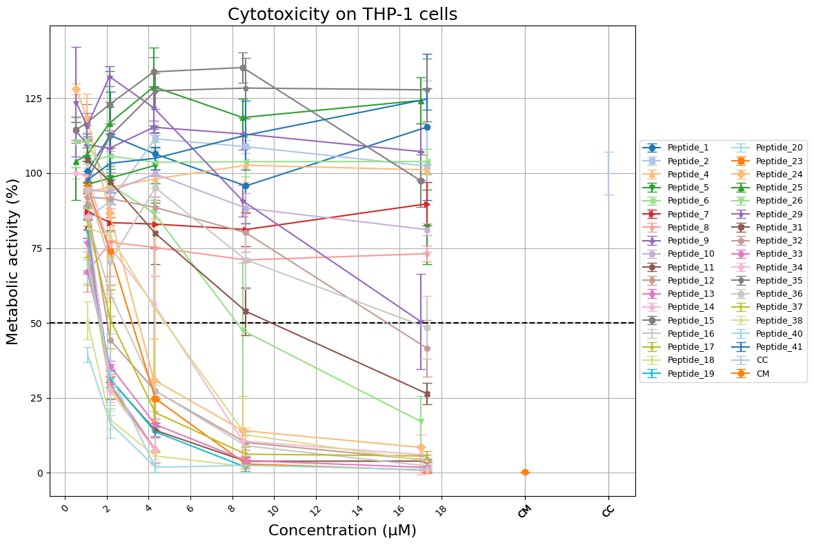

# 🧪 Cytotoxicity & Hemolysis Plotter

This notebook allows you to upload `.xlsx` files and generate clean, consistent plots of **cytotoxicity** or **hemolysis** data from experimental results.

---

## 🔍 Features

- Reads molecule names dynamically from the Excel header
- Automatically groups replicate columns per molecule
- Detects and positions controls (`CC`, `CM`, `CT`) if present
- Assigns each molecule a unique and consistent color + marker
- Offers optional anonymization of peptide names (`Peptide_1`, `Peptide_2`, etc.)
- Supports multiple file uploads and batch plotting
- Saves high-resolution `.png` plots and displays them in-line

---

## 📁 Expected Input Format

Each `.xlsx` file should follow this structure:

| [uM] | Molecule_1 |         |         | Molecule_2 |         |         | CC   | CM   | CT   |
|------|------------|---------|---------|------------|---------|---------|------|------|------|
| 0.5  | 98.5       | 97.9    | 99.1    | 88.2       | 89.5    | 87.4    | NaN  | NaN  | NaN  |
| 1.0  | 97.0       | 98.2    | 96.8    | 85.1       | 86.7    | 85.0    | NaN  | NaN  | NaN  |
| 2.5  | 92.1       | 93.5    | 91.2    | 80.2       | 79.8    | 78.5    | NaN  | NaN  | NaN  |
| NaN  | NaN        | NaN     | NaN     | NaN        | NaN     | NaN     | 99.2 | 98.7 | 97.9 |
| NaN  | NaN        | NaN     | NaN     | NaN        | NaN     | NaN     | 98.8 | 99.1 | 97.5 |

- Replicates are grouped by repeating the molecule name once, followed by empty headers.
- Controls are expected at the end with `NaN` in the concentration column.

---

## ⚙️ How to Use

1. Install required packages: `colorcet`, `openpyxl`
2. Set `ANONYMIZE = True` in the notebook to anonymize peptide names
3. Upload one or more `.xlsx` files using the notebook uploader
4. Run the main analysis cell to generate and save the plots

---

## 📊 Example Output

> **Note:**  
> File names are used to determine the plot title and Y-axis label.  
> - Names containing `"hemo"` or `"lysis"` → **Hemolysis (%)**  
> - Names containing `"thp1"`, `"pbmc"`, `"vero"` → **Metabolic activity (%)**, with the cell line in the title  
> - Other names → default to `"Cytotoxicity"`

---

## ▶️ Launch in Google Colab

---

## 📄 License

MIT License  
© 2025 Sebastián Vera
